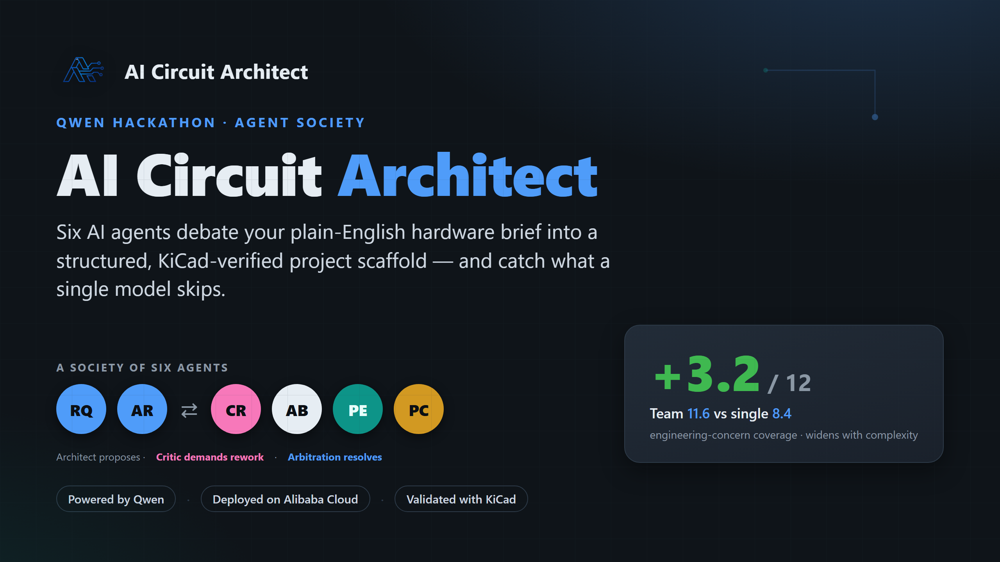
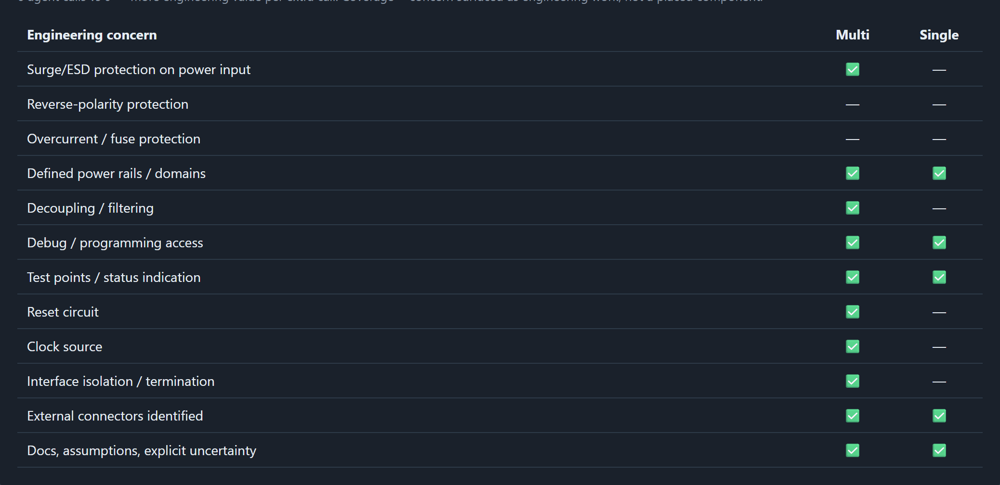
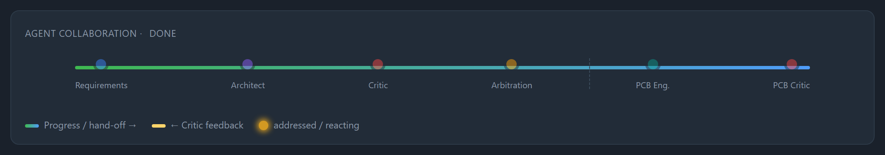
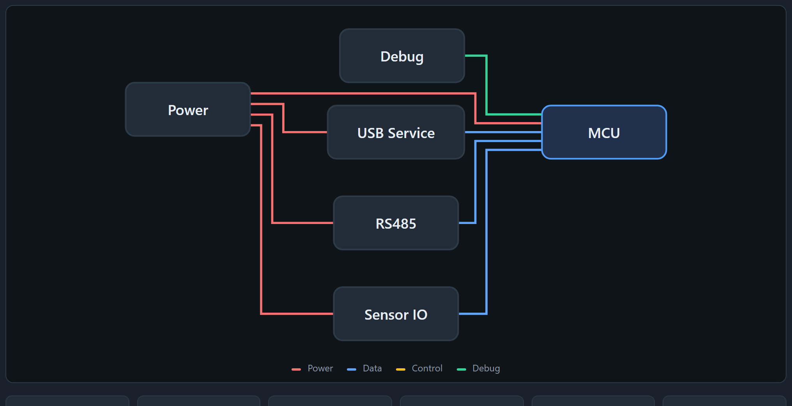
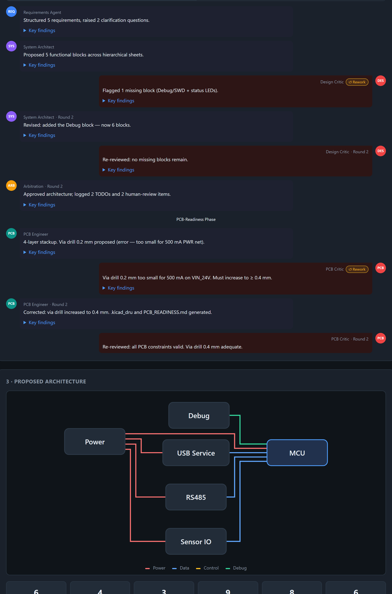

<p align="center">
  
</p>

<h1 align="center">AI Circuit Architect</h1>

<p align="center">
  A society of six AI agents that debates a plain-English hardware brief into a
  <b>structured, KiCad-verified project scaffold</b> — and catches what a single model skips.
</p>

<p align="center">
  <i>Built for the Qwen Cloud Global AI Hackathon 2026 · Track: Agent Society</i><br>
  Powered by Qwen · Deployed on Alibaba Cloud · Validated with KiCad
</p>

---

## What it is

You describe an electronic device in plain English — *"a battery-powered Wi-Fi bat
detector with USB-C charging"* — and a team of specialist AI agents turns it into a
**structured KiCad project scaffold** you can open, inspect and keep building on: a
block-level architecture, hierarchical sheets with power-port symbols and sheet pins,
filled title blocks, a PCB-readiness pack, a PDF report and a downloadable ZIP.

> **Honest scope.** This is a *starting point*, not a finished product. The output is a
> structured **scaffold** that opens in KiCad and passes **structural ERC** — it is
> **not** a complete, wired or manufacturable schematic. The PCB-readiness pack is
> **prep** (constraints, net classes, candidate parts, floorplan zones, a
> design-for-test checklist), **not** layout or routing. The human engineer stays in
> control and approves the architecture before anything is generated. *AI prepares, the
> human decides.*

## Why a team of agents? (the Agent-Society idea)

A single large model, asked to design a circuit, gives a plausible answer — and quietly
skips the boring-but-critical parts: reverse-polarity protection, overcurrent fusing, a
reset line, ESD/surge handling, an explicit statement of what it is *unsure* about.
Those omissions are exactly what an engineering review catches.

So instead of one model, six agents collaborate — and **disagree**:

| # | Agent | Model tier | Role |
|---|-------|-----------|------|
| 1 | **Requirements** | qwen-plus | Structures the brief; asks adaptive A/B/C clarifying questions |
| 2 | **Architect** | qwen-plus | Proposes a block architecture with typed power/data/control connections |
| 3 | **Design Critic** | qwen-max | Reviews the architecture and **demands rework** when blocks/protections are missing |
| 4 | **Arbitration** | qwen-max | Resolves the critic-vs-architect disagreement into a final design |
| 5 | **PCB Engineer** | qwen-plus | Produces the PCB-readiness pack + design-for-test/manufacturing checklist |
| 6 | **PCB Critic** | qwen-max | Reviews that pack and drives a second rework loop |

The **conflict → resolution** character lives in the two rework loops (Design Critic →
Architect, and PCB Critic → PCB Engineer) plus Arbitration — not in a straight pipeline.
You can watch it happen live in the **Agent Society** chat view.

## The measured result

Over 5 diverse, hard designs, the multi-agent system scored **11.6 / 12 vs. 8.4 / 12**
for a fair single-agent baseline — an average **+3.2 coverage gain that widens with
complexity** (Medical wearable +5, Battery IoT +4). Scored by a deterministic 12-concern
rubric, so the number is reproducible, not a vibe. The single pass most often skips
reverse-polarity (5×), overcurrent/fuse (4×), explicit uncertainty (3×), surge/ESD (2×)
and a clock (2×).

<p align="center">
  
</p>

Reproduce it in-app under **Advanced · compare & benchmark** → *🏆 Architecture beats tier*.

## Screenshots

| Live agent collaboration | Proposed architecture |
|---|---|
|  |  |

<p align="center">
  
</p>

## Features

- **Six-agent pipeline** with two real critic→engineer **rework loops** + arbitration
- **Adaptive clarification** — the Requirements agent proposes A/B/C choices instead of dead-end questions
- **Selectable team profiles** (Senior Review Team / Uniform qwen-max / Budget Turbo / Uniform qwen-plus)
- **Audience personas** (Professional / Student / Maker) re-tone every answer
- **Real KiCad validation** via `kicad-cli` — the scaffold is opened, ERC-checked and rendered; an honest **three-state verification badge** (verified-in-KiCad / structural-only / failed)
- **PCB-readiness pack** — net classes, constraints, candidate parts, floorplan zones, DFX checklist
- **Professional PDF report** + downloadable **ZIP** project
- **Efficiency comparison** (multi vs single) and a **preset bench** (cost & quality per profile)
- **API cost guard** — one chokepoint enforcing a hard USD budget, per-call token caps, response caching and rate limits
- **Mock Mode** — the full demo works with prepared data when no Qwen key is set, so it never breaks

## Quick start (local)

```bash
python -m venv .venv
.venv\Scripts\activate          # Windows
# source .venv/bin/activate     # macOS / Linux
pip install -r requirements.txt
uvicorn app.main:app --reload
```

Open <http://localhost:8000>. With no `QWEN_API_KEY` set, the app runs in **Mock Mode**
and the full flow works with prepared example data. To use the real Qwen agents, copy
`.env.example` to `.env` and set your key:

```bash
QWEN_API_KEY=sk-...                 # leave empty for Mock Mode
QWEN_MODEL=qwen-plus
```

## Run with Docker

The image bundles KiCad (`kicad-cli`) so real validation, the schematic preview and the
PDF report work out of the box. It is ~1.3 GB and the first build downloads KiCad, so
allow a few minutes.

```bash
docker compose up --build
```

Then open <http://localhost:8000>. KiCad is GPL-3.0 and bundled as a separate tool — see
[NOTICE.md](NOTICE.md).

## Live demo

A hosted instance runs at **<https://qwen.rocu.de>** (HTTPS via Let's Encrypt, behind
Basic Auth for the hackathon jury — credentials are shared privately). The full
deployment recipe (GitHub Actions → GHCR → Alibaba Cloud ECS + Caddy) is in
[deploy/SERVER_SETUP.md](deploy/SERVER_SETUP.md).

## API

All endpoints are under `/api`. The pipeline degrades gracefully (Mock Mode) on any
missing key, budget/rate limit, timeout or malformed response.

| Method | Path | Purpose |
|--------|------|---------|
| `POST` | `/api/run` | Run the full multi-agent pipeline |
| `POST` | `/api/run/stream` | Same, streamed as server-sent events |
| `POST` | `/api/step` | Step-by-step run with per-stage sign-off |
| `POST` | `/api/generate` | Generate the KiCad scaffold + PDF report + ZIP |
| `GET`  | `/api/download/{id}` | Download the generated project ZIP |
| `GET`  | `/api/report/{id}` | Download the PDF report |
| `POST` | `/api/compare` | Multi-agent vs single-agent coverage comparison |
| `POST` | `/api/bench` | Cost & quality bench across team profiles |
| `GET`  | `/api/guard` | API cost-guard status (budget, rate limits) |
| `GET`  | `/api/health` | Health + mock-mode indicator |

## Architecture

```
User → Orchestrator ─┬─ Requirements → Architect ⇄ Design Critic → Arbitration
                     └─ PCB Engineer ⇄ PCB Critic
                     → (human approval) → KiCad scaffold → kicad-cli validation → PDF + ZIP
```

Agents never talk to each other directly. Only the orchestrator owns state; every agent
is stateless and exchanges structured JSON. This keeps the system deterministic and easy
to debug. `kicad-cli` is invoked as a separate subprocess (a runtime tool), not linked.

**Stack:** Python · FastAPI · Pydantic · Alpine.js (single-page UI) · Qwen Cloud API
(OpenAI-compatible endpoint) · KiCad `kicad-cli` · WeasyPrint (PDF) · Docker · Caddy.

## Tests

```bash
pytest
```

## Known limitations (honest)

- The output is a **scaffold**, not a wired/manufacturable schematic (by design).
- The PDF report renders via WeasyPrint, which needs native Pango/Cairo libraries — it
  renders in the **Docker image** but not on a bare Windows venv (degrades to no PDF).
- `qwen-max` on very complex prompts is slow (>60 s) and can occasionally return
  malformed JSON — both are caught and degrade gracefully to Mock Mode with an honest notice.
- In-app cost figures can read `$0` because the cost guard caches identical requests; a
  live cost demo needs a cold cache.

## License

**MIT** — see [LICENSE](LICENSE). Third-party tools (KiCad, PyMuPDF) are used as separate
programs under their own licenses — see [NOTICE.md](NOTICE.md).
